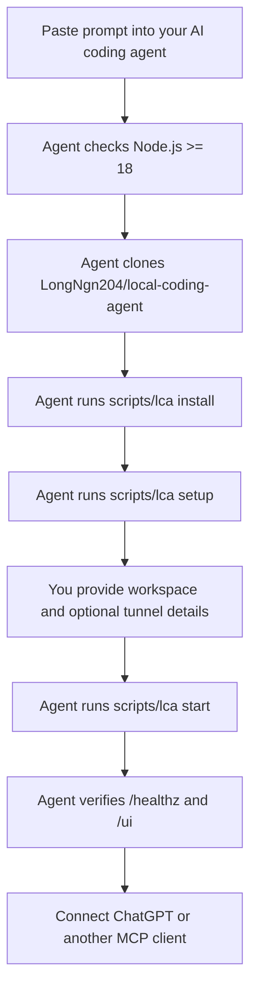
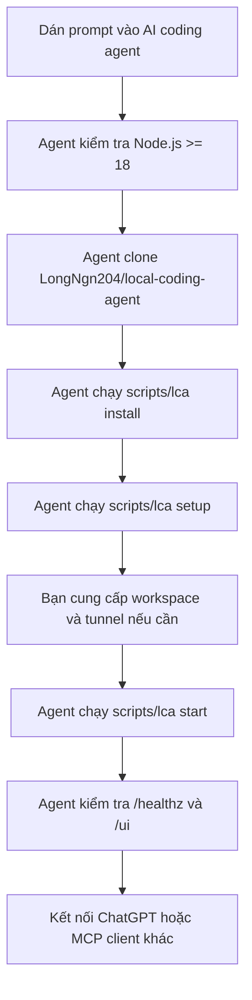

<div align="center">


<h1>Local Coding Agent</h1>

<p><b>Turn your machine into a local MCP coding workspace for AI agents.</b><br/>
Let an AI agent read files, edit code, run checks, inspect git, and show live health metrics from a local dashboard.</p>

<p>
  <a href="https://github.com/LongNgn204/local-coding-agent/releases"></a>
  
  
  <a href="LICENSE"></a>
  
  
  <a href="https://github.com/LongNgn204/local-coding-agent/stargazers"></a>
</p>

<p><b>Works with</b><br/>
  
  
  
  
</p>

<sub>Compatible with any MCP client. Not affiliated with Anthropic, OpenAI, GitHub, or Microsoft.</sub>

<sub>The Community Edition code is open source under AGPL. The project name and brand assets are governed separately by the <a href="TRADEMARKS.md">Trademark Policy</a>.</sub>

<p><b>English</b> | <a href="#tiếng-việt">Tiếng Việt</a></p>

</div>

> This tool can run commands on your computer. Read [SECURITY.md](SECURITY.md)
> before using it. It is not an OS sandbox; only connect workspaces you trust.

> **v4.4.3 stable.** Customer-ready Community Edition patch with ChatGPT Web
> Compact & Resume, smaller tool payloads, safer setup/update prompts, setup
> diagnostics, and clearer support reports. The public branch contains only
> supported stable source.

Existing customers can update safely with `scripts\lca.cmd update` on Windows
or `bash scripts/lca update` on macOS/Linux, then restart the tray app/server.

---

## AI Agent Quick Setup

### English

Use this when you want ChatGPT, Claude Code, Codex, Cursor, or another AI coding
agent to clone, install, verify, update, or diagnose this repo for a customer.

```powershell
node scripts\local-coding-agent.mjs prompt setup
node scripts\local-coding-agent.mjs prompt update
node scripts\local-coding-agent.mjs prompt diagnose
node scripts\local-coding-agent.mjs prompt compact
node scripts\local-coding-agent.mjs prompt resume
node scripts\local-coding-agent.mjs setup-wizard --workspace "C:\path\repo"
node scripts\local-coding-agent.mjs skills doctor
```

- `prompt setup` prints a copy-paste prompt for a fresh customer install.
- `prompt update` prints a safe update prompt that preserves config, tunnel
  client files, secrets, generated profiles, reports, and `server/data`.
- `prompt diagnose` prints a support prompt that collects redacted reports
  instead of pasting long logs into chat.
- `prompt compact` tells ChatGPT Web to save a small structured checkpoint when
  the conversation becomes long or slow.
- `prompt resume` tells a fresh ChatGPT Web chat to load that checkpoint, verify
  the workspace and Git state, and continue from the recorded next action.
- `setup-wizard` checks Node/npm/git, repo layout, server dependencies,
  workspace, tunnel prerequisites, skill validation, and local health, then
  writes `setup-wizard-report.txt`.
- `skills doctor` maps common customer symptoms to the right shipped skill.

Open the dashboard at `http://127.0.0.1:8790/ui` to copy the same setup,
update, diagnose, compact, and resume prompts.

### Tiếng Việt

Dùng phần này khi bạn muốn ChatGPT, Claude Code, Codex, Cursor hoặc một AI coding
agent khác clone, cài đặt, kiểm tra, cập nhật hoặc chẩn đoán repo này cho khách.

```powershell
node scripts\local-coding-agent.mjs prompt setup
node scripts\local-coding-agent.mjs prompt update
node scripts\local-coding-agent.mjs prompt diagnose
node scripts\local-coding-agent.mjs prompt compact
node scripts\local-coding-agent.mjs prompt resume
node scripts\local-coding-agent.mjs setup-wizard --workspace "C:\path\repo"
node scripts\local-coding-agent.mjs skills doctor
```

- `prompt setup` in prompt copy-paste cho khách cài mới.
- `prompt update` in prompt cập nhật an toàn, giữ nguyên config, tunnel-client,
  secret, profile sinh ra, report và `server/data`.
- `prompt diagnose` in prompt hỗ trợ/chẩn đoán, tạo report đã redact thay vì dán
  log dài vào chat.
- `prompt compact` bảo ChatGPT Web lưu checkpoint nhỏ, có cấu trúc khi cuộc trò
  chuyện bắt đầu dài hoặc chậm.
- `prompt resume` bảo chat ChatGPT Web mới tải checkpoint, kiểm tra workspace và
  trạng thái Git rồi tiếp tục từ hành động kế tiếp đã lưu.
- `setup-wizard` kiểm tra Node/npm/git, cấu trúc repo, dependency server,
  workspace, điều kiện tunnel, validate skill và health cục bộ, rồi ghi
  `setup-wizard-report.txt`.
- `skills doctor` map lỗi khách hay gặp sang skill phù hợp trong repo.

Mở dashboard tại `http://127.0.0.1:8790/ui` để copy cùng các prompt setup,
update, diagnose, compact và resume.

---

## English

### Install With Your AI Agent

The easiest path is to let a strong AI coding agent do the setup for you. Copy
this prompt into Codex, Claude Code, Cursor, or another local coding agent:

```text
Please install Local Coding Agent on my machine.

Repository:
https://github.com/LongNgn204/local-coding-agent

Goal:
Clone the repo, install it, configure a workspace, start the MCP server, and
verify the dashboard.

Rules:
- Do not install system dependencies without asking me first.
- Do not download, commit, or redistribute tunnel-client. I will provide it if needed.
- Do not commit secrets, API keys, tunnel IDs, local config, or generated profiles.
- Default to mode=safe and policy=balanced.
- Use the universal CLI first. Use the Windows tray app only if I ask for GUI.
- If anything fails, show the exact error and the next command to fix it.

Steps:
1. Clone https://github.com/LongNgn204/local-coding-agent if it is not already cloned.
2. Enter the repo directory and read AGENTS.md; follow it exactly.
3. Check Node.js version is >= 18 (node -v).
4. Install with:
   - Windows: scripts\lca.cmd install
   - macOS/Linux: bash scripts/lca install
5. Run setup with:
   - Windows: scripts\lca.cmd setup
   - macOS/Linux: bash scripts/lca setup
6. Ask me for the workspace folder the AI may access.
7. If I want ChatGPT Web tunnel access, ask me for tunnel-client path, tunnel ID,
   organization ID if required, and Runtime API key.
8. Start with:
   - Windows: scripts\lca.cmd start
   - macOS/Linux: bash scripts/lca start
9. Verify:
   - http://127.0.0.1:8787/healthz returns status ok
   - http://127.0.0.1:8790/ui opens the dashboard
   - Run the tool suite: from server/ run npm run test:agent
   - status command works
10. Explain the results to me in plain language: what passed, what failed, and
    the exact next command to fix anything that failed.
11. Report the MCP URL, dashboard URL, workspace path, mode, policy, and tunnel status.
```

More prompt variants are in [docs/AI_AGENT_SETUP_PROMPT.md](docs/AI_AGENT_SETUP_PROMPT.md).
For existing installs, use [docs/CUSTOMER_UPDATE_PROMPT.md](docs/CUSTOMER_UPDATE_PROMPT.md).

### Setup Map



### Manual Quickstart

Windows:

```powershell
git clone https://github.com/LongNgn204/local-coding-agent.git
cd local-coding-agent
scripts\lca.cmd install
scripts\lca.cmd setup
scripts\lca.cmd start
```

macOS / Linux:

```bash
git clone https://github.com/LongNgn204/local-coding-agent.git
cd local-coding-agent
bash scripts/lca install
bash scripts/lca setup
bash scripts/lca start
```

Open:

```text
http://127.0.0.1:8790/ui
```

Useful commands:

```text
status   show MCP URL, dashboard URL, process status
doctor   check local setup and common missing requirements
update   safely fetch/pull latest main, reinstall dependencies, validate skills
skills   list or validate the shipped skill pack
open     open the local dashboard
stop     stop the server and tunnel started by the CLI
logs     show launcher logs
url      print the MCP URL
```

### Windows Tray App

The Windows tray app is a GUI supervisor for the same local server and tunnel.
It can start/stop the server, save tunnel settings, copy the MCP URL, open the
dashboard, and store the Runtime API key encrypted with Windows DPAPI.

Download the self-contained `.exe` from
[Releases](https://github.com/LongNgn204/local-coding-agent/releases), or build
it yourself:

```powershell
cd tray-app
powershell -ExecutionPolicy Bypass -File build.ps1
```

The tray app is optional. The universal CLI is recommended for customers on
Windows, macOS, and Linux because it does not require building a GUI app.

### Connect To ChatGPT Web

1. Start the local server first and verify the dashboard.
2. Put the OpenAI tunnel client in `tools/tunnel-client.exe` on Windows or
   `tools/tunnel-client` on macOS/Linux.
3. Create or choose a tunnel in ChatGPT/OpenAI.
4. Provide the same Tunnel ID during `scripts/lca setup`.
5. Use a Runtime API key for `CONTROL_PLANE_API_KEY`. Do not use an Admin key.
6. If your organization requires it, provide the OpenAI Organization ID.
7. Start the CLI or tray app and keep it running while ChatGPT uses the tools.

The local URL `http://127.0.0.1:8787/mcp` is for your machine. ChatGPT Web must
connect through the secure tunnel, not by pasting the local loopback URL.

### Customer Network Diagnostics

If the customer says it works on mobile hotspot but fails on office/internal
network, ask them to run Network Doctor on the failing network and send the
redacted report.

Basic check:

```powershell
node scripts\network-doctor.mjs
```

Tunnel smoke test:

```powershell
$env:CONTROL_PLANE_API_KEY="sk-proj-..."
node scripts\network-doctor.mjs --tunnel-bin "tools\tunnel-client.exe" --tunnel-id "tunnel_..." --organization-id "org_..." --duration 30
```

Guide: [docs/NETWORK_DOCTOR.md](docs/NETWORK_DOCTOR.md).

For a full, redacted support bundle a customer can send back to the developer:

```powershell
node scripts\support-report.mjs
scripts\lca.cmd support
```

It prints a compact summary and writes a redacted `support-report.txt`
(versions, Node, ports 8787/8790, tunnel-client presence, health, recent
errors). It never requires the proprietary tunnel client and never writes keys
or tokens.

### Stable Anti-Lag Workflow

v4.4.3 reduces ChatGPT Web lag by keeping default tool outputs smaller
and steering AI agents toward targeted reads instead of dumping huge logs,
diffs, base64, or icon inventories into the chat.

- `read_file` default output is tighter, while `max_chars` can still be raised
  for a specific targeted read.
- `run_command` default output is tighter, while `max_output_chars`,
  `head_lines`, and `tail_lines` can still be used for focused debugging.
- `read_many` has a smaller default batch cap so one call cannot flood a long
  ChatGPT thread.
- Dashboard tips now surface `large_payloads` and `command_heavy` as signals to
  switch to line ranges, globs, and compact summaries.
- Customer prompts now explicitly tell AI agents not to paste full logs, diffs,
  base64, image/icon inventories, or generated reports into chat.

For large tasks, start a fresh ChatGPT thread, use `workspace_snapshot` first,
read only the line ranges you need, and keep raw artifacts as local files or
support reports.

### ChatGPT Web Compact & Resume

Local Coding Agent cannot read or replace ChatGPT Web's internal context
window. Instead, v4.4.3 provides a safe MCP handoff that feels similar in use:

1. In the long chat, call `context_status`, then `compact_context`.
2. The server stores a local structured checkpoint with the goal, decisions,
   constraints, completed work, open tasks, next action, Git state, and recent
   test evidence.
3. Open a fresh chat and call `resume_context` first.
4. Verify `workspace_info` and `git_status`, then continue the recorded action.

Generate the copy-paste prompts with:

```powershell
node scripts\local-coding-agent.mjs prompt compact
node scripts\local-coding-agent.mjs prompt resume
```

Only MCP tool-traffic pressure is estimated; it is not ChatGPT's actual token
or context-window usage. Checkpoints stay under `server/data/`, which is ignored
by Git, and use best-effort credential redaction. Never submit secrets or full
source/log dumps to `compact_context`. See
[docs/CHATGPT_WEB_COMPACT.md](docs/CHATGPT_WEB_COMPACT.md).

### Features

| Area | What it does |
|---|---|
| Workspace | `workspace_info`, `workspace_snapshot`, `workspace_doctor`, `repo_map` |
| Files | `list_files`, `read_file`, `read_many`, `write_file`, `replace_in_file`, `apply_patch` |
| Search | `search_text`, `find_files`, `repo_symbols`, `important_files` |
| Commands | `run_command`, `run_commands`, `proc_start`, `proc_output`, `quality_gate` |
| Git | `git_status`, `git_diff`, `review_diff`, guarded `git` helper |
| Safety | `policy_status`, `explain_risk`, `request_approval`, `request_approval_batch` |
| Dashboard | health score, latency, tool calls, approvals, file viewer, git diff |
| Workflow | `context_status`, `compact_context`, `resume_context`, notes, session reports, task state, decision log, skills |

Shipped skills can be checked with:

```powershell
scripts\lca.cmd skills list
scripts\lca.cmd skills validate
```

### Safety Defaults

Recommended defaults:

```text
AGENT_MODE=safe
AGENT_POLICY=balanced
DASHBOARD_PORT=8790
```

Security notes:

- File tools are confined to configured workspace roots.
- Command execution is not an OS sandbox.
- Use `safe` mode for customers unless they explicitly accept `full`.
- Use `balanced` policy so risky actions require local approval.
- Use `MCP_AUTH_TOKEN` when exposing the server through a tunnel.
- Do not commit API keys, tunnel profiles, generated config, or logs with secrets.
- Use a VM/container for untrusted repositories.

### Troubleshooting

| Problem | What to check |
|---|---|
| `node` not found | Install Node.js 18+ and reopen the terminal. |
| `server/node_modules is missing` | Run `scripts\lca.cmd install` or `bash scripts/lca install`. |
| Dashboard offline | Check `http://127.0.0.1:8787/healthz`, then run `status` or `doctor`. |
| Port conflict | Change `--port` or `--dashboard-port`; do not use `8788` for the dashboard. |
| `tunnel-client` not found | Put the user-supplied tunnel client in `tools/` or set its path in setup. |
| `tunnel_active_organization_required` | Provide the OpenAI Organization ID that owns the tunnel. |
| `401 Unauthorized` | Use a Runtime API key, not an Admin key; check organization/project access. |
| `poll failed` or `forcibly closed` | Run Network Doctor; office firewall/proxy may block tunnel/WebSocket traffic. |
| Edits appear in the wrong repo | Run `workspace_info` and confirm the exact workspace path. |

### Development

Server tests:

```bash
cd server
npm run test:agent
npm run test:pro
npm run test:security
npm run test:hardening
npm run eval
```

Tray app build:

```powershell
cd tray-app
dotnet build LocalCodingAgentTray.csproj -c Release
```

### License And Trademark

The Local Coding Agent Community Edition code is licensed under
[AGPL-3.0-or-later](LICENSE). Copyright © 2026 Long Nguyễn
([@LongNgn204](https://github.com/LongNgn204)).

The code license does not grant permission to present a fork, service, or
modified binary as an official Local Coding Agent release. See
[NOTICE.md](NOTICE.md), [TRADEMARKS.md](TRADEMARKS.md), and
[BRAND-GUIDELINES.md](BRAND-GUIDELINES.md). The owner can use the
[trademark registration checklist](docs/TRADEMARK-REGISTRATION-CHECKLIST.md) to
prepare a formal filing. Local Coding Agent is an independent project and is not
an official product of OpenAI or any other MCP client vendor.

---

## Tiếng Việt

### Cài Đặt Bằng AI Agent Của Bạn

Cách dễ nhất là để một AI coding agent mạnh làm phần setup giúp bạn. Copy prompt
này vào Codex, Claude Code, Cursor hoặc một local coding agent khác:

```text
Hãy cài Local Coding Agent trên máy của tôi.

Repository:
https://github.com/LongNgn204/local-coding-agent

Mục tiêu:
Clone repo, cài dependency, cấu hình workspace, khởi động MCP server và kiểm tra
dashboard.

Quy tắc:
- Không tự cài dependency hệ thống nếu chưa hỏi tôi trước.
- Không tải, commit hoặc phân phối lại tunnel-client. Tôi sẽ tự cung cấp nếu cần.
- Không commit secret, API key, Tunnel ID, local config hoặc generated profile.
- Mặc định dùng mode=safe và policy=balanced.
- Ưu tiên dùng universal CLI. Chỉ dùng Windows tray app nếu tôi yêu cầu GUI.
- Nếu lỗi, hãy báo đúng lỗi và lệnh tiếp theo để sửa.

Các bước:
1. Clone https://github.com/LongNgn204/local-coding-agent nếu repo chưa tồn tại.
2. Đi vào thư mục repo và đọc AGENTS.md; làm theo đúng hướng dẫn.
3. Kiểm tra Node.js version >= 18 (node -v).
4. Cài đặt bằng:
   - Windows: scripts\lca.cmd install
   - macOS/Linux: bash scripts/lca install
5. Chạy setup bằng:
   - Windows: scripts\lca.cmd setup
   - macOS/Linux: bash scripts/lca setup
6. Hỏi tôi thư mục workspace mà AI được phép truy cập.
7. Nếu tôi muốn kết nối ChatGPT Web qua tunnel, hãy hỏi tunnel-client path,
   Tunnel ID, Organization ID nếu cần, và Runtime API key.
8. Khởi động bằng:
   - Windows: scripts\lca.cmd start
   - macOS/Linux: bash scripts/lca start
9. Kiểm tra:
   - http://127.0.0.1:8787/healthz trả về status ok
   - http://127.0.0.1:8790/ui mở được dashboard
   - Chạy bộ test tool: trong thư mục server/ chạy npm run test:agent
   - lệnh status chạy được
10. Giải thích kết quả cho tôi bằng lời dễ hiểu: cái gì đạt, cái gì lỗi, và lệnh
    tiếp theo chính xác để sửa phần lỗi.
11. Báo lại MCP URL, Dashboard URL, workspace path, mode, policy và trạng thái tunnel.
```

Các prompt khác nằm ở [docs/AI_AGENT_SETUP_PROMPT.md](docs/AI_AGENT_SETUP_PROMPT.md).
Nếu đã cài rồi và muốn update, dùng [docs/CUSTOMER_UPDATE_PROMPT.md](docs/CUSTOMER_UPDATE_PROMPT.md).

### Sơ Đồ Setup



### Bắt Đầu Nhanh Thủ Công

Windows:

```powershell
git clone https://github.com/LongNgn204/local-coding-agent.git
cd local-coding-agent
scripts\lca.cmd install
scripts\lca.cmd setup
scripts\lca.cmd start
```

macOS / Linux:

```bash
git clone https://github.com/LongNgn204/local-coding-agent.git
cd local-coding-agent
bash scripts/lca install
bash scripts/lca setup
bash scripts/lca start
```

Mở:

```text
http://127.0.0.1:8790/ui
```

Các lệnh hữu ích:

```text
status   xem MCP URL, Dashboard URL và trạng thái tiến trình
doctor   kiểm tra setup local và các thiếu sót thường gặp
update   fetch/pull main an toàn, cài lại dependency, validate skill
skills   liệt kê hoặc validate skill pack đi kèm
open     mở dashboard local
stop     dừng server và tunnel do CLI khởi động
logs     xem log launcher
url      in MCP URL
```

### Windows Tray App

Windows tray app là GUI supervisor cho cùng local server và tunnel. Nó có thể
start/stop server, lưu tunnel settings, copy MCP URL, mở dashboard và lưu Runtime
API key bằng Windows DPAPI.

Tải file `.exe` self-contained từ
[Releases](https://github.com/LongNgn204/local-coding-agent/releases), hoặc tự
build:

```powershell
cd tray-app
powershell -ExecutionPolicy Bypass -File build.ps1
```

Tray app là tuỳ chọn. Universal CLI vẫn là hướng khuyên dùng cho khách trên
Windows, macOS và Linux vì không cần build GUI app.

### Kết Nối Với ChatGPT Web

1. Khởi động local server trước và kiểm tra dashboard.
2. Đặt OpenAI tunnel client ở `tools/tunnel-client.exe` trên Windows hoặc
   `tools/tunnel-client` trên macOS/Linux.
3. Tạo hoặc chọn một tunnel trong ChatGPT/OpenAI.
4. Nhập cùng Tunnel ID đó trong `scripts/lca setup`.
5. Dùng Runtime API key cho `CONTROL_PLANE_API_KEY`. Không dùng Admin key.
6. Nếu tổ chức yêu cầu, nhập OpenAI Organization ID.
7. Khởi động CLI hoặc tray app và giữ nó chạy khi ChatGPT dùng tool.

URL local `http://127.0.0.1:8787/mcp` chỉ dành cho máy của bạn. ChatGPT Web phải
kết nối qua secure tunnel, không phải bằng cách dán loopback URL local.

### Chẩn Đoán Mạng Cho Khách

Nếu khách nói dùng hotspot thì chạy được nhưng mạng công ty/nội bộ thì lỗi, hãy
bảo họ chạy Network Doctor trên đúng mạng đang lỗi và gửi lại report đã redact.

Kiểm tra cơ bản:

```powershell
node scripts\network-doctor.mjs
```

Smoke test tunnel:

```powershell
$env:CONTROL_PLANE_API_KEY="sk-proj-..."
node scripts\network-doctor.mjs --tunnel-bin "tools\tunnel-client.exe" --tunnel-id "tunnel_..." --organization-id "org_..." --duration 30
```

Hướng dẫn: [docs/NETWORK_DOCTOR.md](docs/NETWORK_DOCTOR.md).

Để tạo gói hỗ trợ đầy đủ (đã che secret) mà khách gửi lại cho nhà phát triển:

```powershell
node scripts\support-report.mjs
scripts\lca.cmd support
```

Lệnh in ra tóm tắt gọn và ghi file `support-report.txt` đã redact (phiên bản,
Node, cổng 8787/8790, có tunnel-client hay không, health, lỗi gần đây). Nó không
cần tunnel client độc quyền và không bao giờ ghi key hay token.

### Quy Trình Chống Lag Stable

v4.4.3 giảm lag ChatGPT Web bằng cách thu nhỏ default output của tool và
hướng AI agent đọc đúng phần cần thiết thay vì đổ log, diff, base64 hoặc danh
sách icon khổng lồ vào chat.

- `read_file` có default output gọn hơn, nhưng vẫn tăng được `max_chars` khi cần
  đọc đúng một phần mục tiêu.
- `run_command` có default output gọn hơn, nhưng vẫn dùng được
  `max_output_chars`, `head_lines` và `tail_lines` khi debug.
- `read_many` có batch cap mặc định nhỏ hơn để một call không làm nghẹt thread
  ChatGPT dài.
- Dashboard tips báo `large_payloads` và `command_heavy` để nhắc chuyển sang
  line range, glob và tóm tắt gọn.
- Prompt cho khách giờ nhắc rõ AI agent không được dán full log, diff, base64,
  image/icon inventory hoặc report dài vào chat.

Với tác vụ lớn, hãy mở thread ChatGPT mới, gọi `workspace_snapshot` trước, chỉ
đọc đúng line range cần thiết và giữ artifact thô trong file local hoặc support
report.

### Compact & Resume Cho ChatGPT Web

Local Coding Agent không thể đọc hoặc thay thế context nội bộ của ChatGPT Web.
Thay vào đó, v4.4.3 cung cấp quy trình bàn giao MCP an toàn với trải nghiệm gần
giống compact:

1. Trong chat dài, gọi `context_status`, sau đó gọi `compact_context`.
2. Server lưu checkpoint có cấu trúc tại máy, gồm mục tiêu, quyết định, ràng
   buộc, việc đã xong, việc còn lại, hành động kế tiếp, Git state và test gần đây.
3. Mở chat mới và gọi `resume_context` đầu tiên.
4. Kiểm tra `workspace_info` và `git_status`, rồi tiếp tục hành động đã lưu.

Tạo prompt copy-paste bằng:

```powershell
node scripts\local-coding-agent.mjs prompt compact
node scripts\local-coding-agent.mjs prompt resume
```

Hệ thống chỉ ước tính áp lực từ dữ liệu tool đi qua MCP, không phải token hay
context window thật của ChatGPT. Checkpoint nằm trong `server/data/`, đã được
Git bỏ qua, và có redact credential theo best effort. Không gửi secret, full
source hoặc full log vào `compact_context`. Xem
[docs/CHATGPT_WEB_COMPACT.md](docs/CHATGPT_WEB_COMPACT.md).

### Tính Năng

| Nhóm | Chức năng |
|---|---|
| Workspace | `workspace_info`, `workspace_snapshot`, `workspace_doctor`, `repo_map` |
| File | `list_files`, `read_file`, `read_many`, `write_file`, `replace_in_file`, `apply_patch` |
| Tìm kiếm | `search_text`, `find_files`, `repo_symbols`, `important_files` |
| Command | `run_command`, `run_commands`, `proc_start`, `proc_output`, `quality_gate` |
| Git | `git_status`, `git_diff`, `review_diff`, helper `git` có guard |
| An toàn | `policy_status`, `explain_risk`, `request_approval`, `request_approval_batch` |
| Dashboard | health score, latency, tool calls, approvals, file viewer, git diff |
| Workflow | `context_status`, `compact_context`, `resume_context`, notes, session reports, task state, decision log, skills |

Kiểm tra skill đi kèm:

```powershell
scripts\lca.cmd skills list
scripts\lca.cmd skills validate
```

### Mặc Định An Toàn

Khuyến nghị mặc định:

```text
AGENT_MODE=safe
AGENT_POLICY=balanced
DASHBOARD_PORT=8790
```

Ghi chú bảo mật:

- File tools bị giới hạn trong các workspace root đã cấu hình.
- Chạy command không phải là OS sandbox.
- Dùng `safe` mode cho khách trừ khi họ chủ động chấp nhận `full`.
- Dùng `balanced` policy để hành động rủi ro cần duyệt local.
- Dùng `MCP_AUTH_TOKEN` khi expose server qua tunnel.
- Không commit API key, tunnel profile, generated config hoặc log có secret.
- Dùng VM/container cho repo không tin cậy.

### Khắc Phục Sự Cố

| Lỗi | Cần kiểm tra |
|---|---|
| Không thấy `node` | Cài Node.js 18+ rồi mở lại terminal. |
| `server/node_modules is missing` | Chạy `scripts\lca.cmd install` hoặc `bash scripts/lca install`. |
| Dashboard offline | Kiểm tra `http://127.0.0.1:8787/healthz`, rồi chạy `status` hoặc `doctor`. |
| Đụng port | Đổi `--port` hoặc `--dashboard-port`; không dùng `8788` cho dashboard. |
| Không thấy `tunnel-client` | Đặt tunnel client do người dùng cung cấp vào `tools/` hoặc set path trong setup. |
| `tunnel_active_organization_required` | Nhập OpenAI Organization ID sở hữu tunnel. |
| `401 Unauthorized` | Dùng Runtime API key, không dùng Admin key; kiểm tra quyền organization/project. |
| `poll failed` hoặc `forcibly closed` | Chạy Network Doctor; firewall/proxy công ty có thể chặn tunnel/WebSocket. |
| Sửa nhầm repo | Chạy `workspace_info` và kiểm tra workspace path thật. |

### Phát Triển

Test server:

```bash
cd server
npm run test:agent
npm run test:pro
npm run test:security
npm run test:hardening
npm run eval
```

Build tray app:

```powershell
cd tray-app
dotnet build LocalCodingAgentTray.csproj -c Release
```

### Giấy Phép Và Nhãn Hiệu

Mã nguồn Local Coding Agent Community Edition được phát hành theo
[AGPL-3.0-or-later](LICENSE). Bản quyền © 2026 Long Nguyễn
([@LongNgn204](https://github.com/LongNgn204)).

Giấy phép code không cấp quyền giới thiệu một fork, dịch vụ hoặc binary đã sửa
đổi như bản phát hành Local Coding Agent chính thức. Xem
[NOTICE.md](NOTICE.md), [TRADEMARKS.md](TRADEMARKS.md) và
[BRAND-GUIDELINES.md](BRAND-GUIDELINES.md). Chủ dự án có thể dùng
[checklist đăng ký nhãn hiệu](docs/TRADEMARK-REGISTRATION-CHECKLIST.md) để chuẩn
bị hồ sơ chính thức. Local Coding Agent là dự án độc lập, không phải sản phẩm
chính thức của OpenAI hoặc bất kỳ nhà cung cấp MCP client nào khác.
