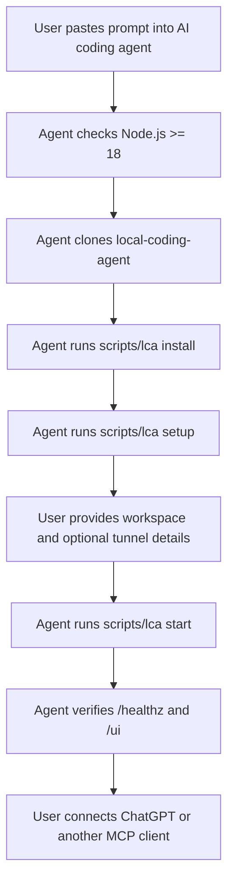

# AI Agent Setup Prompts

Use these prompts with Codex, Claude Code, Cursor, or another local coding
agent. They are designed so a strong AI model can clone this repository, install
dependencies, configure the local workspace, and verify that Local Coding Agent
is running.

## Full Setup Prompt

```text
Please install Local Coding Agent on my machine.

Repository:
https://github.com/LongNgn204/local-coding-agent

Goal:
Clone the repo, install it, configure a workspace, start the MCP server, and
verify the dashboard.

Rules:
- Do not install system dependencies without asking me first.
- Do not download, commit, or redistribute tunnel-client. I will provide it if needed.
- Do not commit secrets, API keys, tunnel IDs, local config, or generated profiles.
- Default to mode=safe and policy=balanced.
- Use the universal CLI first. Use the Windows tray app only if I ask for GUI.
- If anything fails, show the exact error and the next command to fix it.

Steps:
1. Check Node.js version is >= 18.
2. Clone https://github.com/LongNgn204/local-coding-agent if it is not already cloned.
3. Enter the repo directory.
4. Install with:
   - Windows: scripts\lca.cmd install
   - macOS/Linux: bash scripts/lca install
5. Run setup with:
   - Windows: scripts\lca.cmd setup
   - macOS/Linux: bash scripts/lca setup
6. Ask me for the workspace folder the AI may access.
7. If I want ChatGPT Web tunnel access, ask me for tunnel-client path, tunnel ID,
   organization ID if required, and Runtime API key.
8. Start with:
   - Windows: scripts\lca.cmd start
   - macOS/Linux: bash scripts/lca start
9. Verify:
   - http://127.0.0.1:8787/healthz returns status ok
   - http://127.0.0.1:8790/ui opens the dashboard
   - status command works
10. Report the MCP URL, dashboard URL, workspace path, mode, policy, and tunnel status.
```

## Server-Only Prompt

Use this first if you want to test the local dashboard without configuring the
OpenAI secure tunnel.

```text
Clone and run Local Coding Agent in server-only mode.

Repository:
https://github.com/LongNgn204/local-coding-agent

Rules:
- Do not install system dependencies without asking me first.
- Do not configure tunnel-client yet.
- Do not commit secrets or local config files.
- Use mode=safe and policy=balanced.

Steps:
1. Check Node.js version is >= 18.
2. Clone the repository if needed.
3. Enter the repo directory.
4. Install dependencies:
   - Windows: scripts\lca.cmd install
   - macOS/Linux: bash scripts/lca install
5. Ask me for the workspace folder the AI may access.
6. Start server-only:
   - Windows: scripts\lca.cmd start --no-tunnel --workspace "<workspace path>"
   - macOS/Linux: bash scripts/lca start --no-tunnel --workspace "<workspace path>"
7. Verify:
   - http://127.0.0.1:8787/healthz
   - http://127.0.0.1:8790/ui
8. Report the MCP URL, dashboard URL, workspace path, mode, and policy.
```

## Power-User Prompt

```text
Set up Local Coding Agent as a local MCP coding workspace.

Repository:
https://github.com/LongNgn204/local-coding-agent

Use the universal CLI:
- node scripts/local-coding-agent.mjs install
- node scripts/local-coding-agent.mjs setup
- node scripts/local-coding-agent.mjs start

Prefer:
- AGENT_MODE=safe
- AGENT_POLICY=balanced
- CONTROL_PLANE_API_KEY from an environment variable instead of a tracked file

Never download or commit tunnel-client, API keys, generated profiles, or local
config files.

After starting, verify:
- /healthz returns status ok
- /ui dashboard loads
- status command works
- workspace path is correct

Then provide a short setup report with:
- repo location
- workspace root
- MCP URL
- dashboard URL
- tunnel status
- next step to connect ChatGPT or another MCP client
```

## Setup Map


